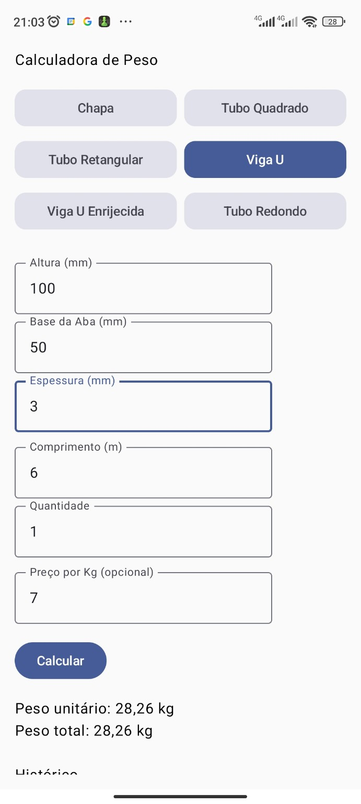
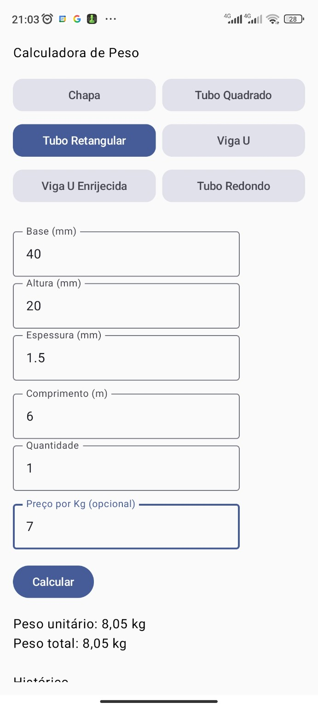
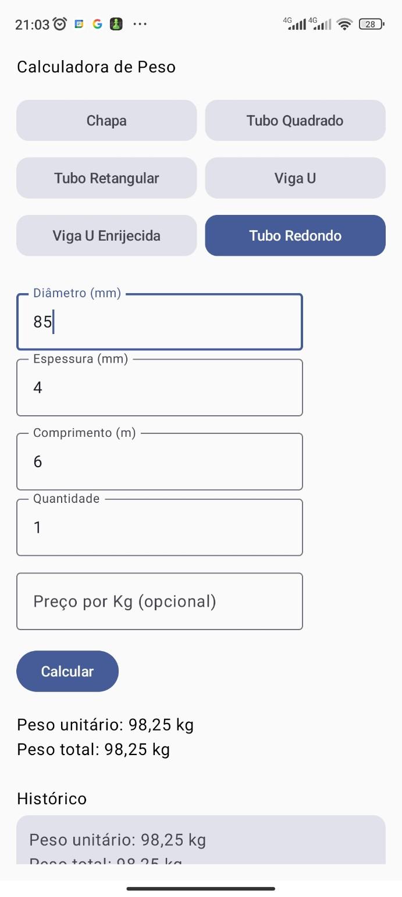

# 📱 Calculadora de Peso de Materiais Metálicos

Aplicativo Android desenvolvido em **Kotlin** com **Jetpack Compose** para cálculo de peso e valor de peças metálicas utilizadas na indústria metalúrgica.

O projeto foi criado com base em necessidades reais de cálculo no dia a dia de oficina/serralheria, permitindo calcular peso unitário, peso por metro e valor total de diferentes perfis metálicos.

---

## 🚀 Tecnologias Utilizadas

- Kotlin
- Jetpack Compose
- Material 3
- ViewModel + StateFlow
- Hilt (injeção de dependências)
- Room (persistência local)
- Coroutines + Flow
- Exportação de PDF

---

## 🎯 Funcionalidades

O aplicativo já oferece:

- ✅ Cálculo de peso por tipo de peça
- ✅ Kg por metro
- ✅ Peso total por quantidade
- ✅ Cálculo de valor por Kg (opcional)
- ✅ Salvar orçamento no histórico
- ✅ Visualizar histórico de orçamentos
- ✅ Compartilhar orçamento em PDF
- ✅ Seleção de material (Aço, Inox, Alumínio)
- ✅ Validações de entrada com mensagens de erro
- ✅ Suíte inicial de testes unitários (domain + ViewModel)

---

## 🧱 Tipos de Peças Suportadas

- Chapa
- Tubo Quadrado
- Tubo Retangular
- Viga U
- Viga U Enrijecida
- Tubo Redondo

---

## 🧮 Estrutura de Cálculo

As regras matemáticas ficam isoladas na camada **domain**, através do objeto:

```kotlin
CalculadoraPeso
```

Ele contém funções específicas para cada tipo de peça:

- `calcularChapa()`
- `calcularTuboQuadrado()`
- `calcularTuboRetangular()`
- `calcularVigaU()`
- `calcularVigaUEnrijecida()`
- `calcularTuboRedondo()`

---

## 📂 Estrutura do Projeto

```text
com.orcamentoevendas
│
├── data/
│   ├── local/           # Room (DAO, entities, database)
│   └── repository/      # Repositórios da aplicação
│
├── di/                  # Módulos Hilt
│
├── domain/              # Regras de cálculo e modelos de domínio
│
├── ui/
│   ├── components/      # Componentes reutilizáveis
│   ├── screens/         # Telas Compose
│   ├── state/           # UiState
│   └── viewmodel/       # ViewModels
│
└── MainActivity.kt
```

- **data** → Persistência local e acesso a dados
- **di** → Configuração de injeção de dependências
- **domain** → Regras de negócio e cálculos
- **ui** → Interface, estado de tela e fluxo de interação

---

## 📌 Conversões Importantes

- Conversão de milímetros para metros: `mm / 1000.0`
- Quantidade padrão = `1` se valor inválido
- Densidades disponíveis: Aço, Inox e Alumínio

---


## ✅ Validação Atual

A validação principal do app está sendo feita em **dispositivo Android real**, com foco em uso prático:

- Compilação e instalação do APK no aparelho
- Execução dos fluxos principais sem falhas
- Conferência dos cálculos com cenários reais de uso

> Observação: a estratégia de validação atual combina **teste prático em dispositivo real** com **testes unitários no projeto** para proteger regras de cálculo e comportamento do ViewModel.

---


## 🧪 Testes Automatizados

Atualmente o projeto possui uma base inicial de testes cobrindo regras essenciais:

- `CalculadoraPesoTest`: valida fórmulas e casos de borda da camada de domínio
- `CalculadoraViewModelTest`: valida cálculo por material, mensagens de erro e persistência
- `MainDispatcherRule`: suporte para testes de corrotinas com `viewModelScope`

Esses testes reduzem regressões e complementam a validação prática no dispositivo Android.

---

## ➡️ Próximo Passo Sugerido

Com material, validações e testes iniciais implementados, o próximo passo recomendado é a **migração da navegação para `NavHost` com rotas tipadas**:

1. Definir destinos tipados para `Calculadora` e `Histórico`
2. Centralizar argumentos/rotas em um único arquivo de navegação
3. Cobrir fluxo de navegação com testes instrumentados básicos

Isso reduz erros de rota, melhora manutenção e prepara o app para novas telas.

---

## 🛠️ Roadmap

- [x] Implementar ViewModel (MVVM incremental)
- [x] Persistência de histórico com Room
- [x] Melhorar UI com Material 3 e cards de resultado
- [x] Compartilhar orçamento em PDF
- [x] Implementar seleção de material (aço, inox, alumínio)
- [x] Melhorar validações e mensagens de erro de entrada
- [ ] Migrar navegação para `NavHost` (rotas tipadas)
- [x] Expandir testes unitários de cálculo e ViewModel

---

## 🧠 Objetivo do Projeto

Este projeto faz parte da minha evolução como desenvolvedor Android, aplicando:

- Modelagem de domínio
- Separação de responsabilidades
- Organização arquitetural progressiva
- Boas práticas de commits
- Evolução incremental com foco em qualidade

---

## 📸 Screenshots

<p align="center">
  
  
  
</p>

---

## 👨‍💻 Autor

Desenvolvido por João Manoel.
