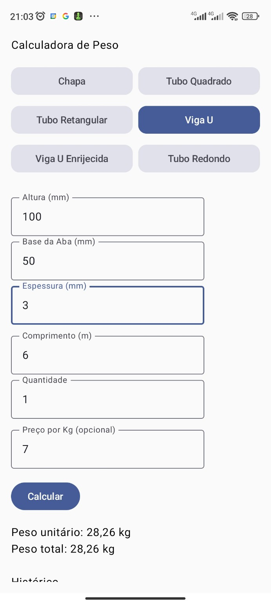
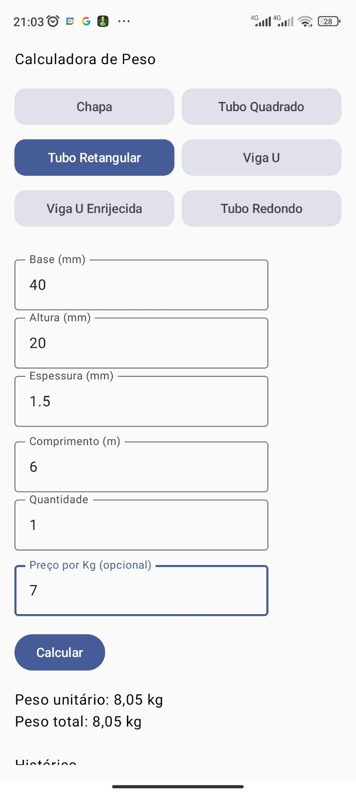
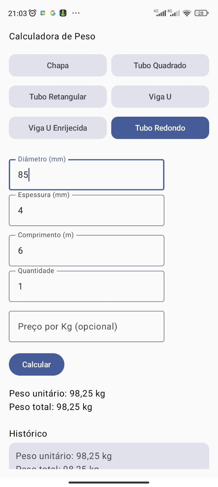

# 📱 Calculadora de Peso de Materiais Metálicos

Aplicativo Android desenvolvido em **Kotlin** com **Jetpack Compose** para cálculo de peso e valor de peças metálicas utilizadas na indústria metalúrgica.

O projeto foi criado com base em necessidades reais de cálculo no dia a dia de oficina/serralheria, permitindo calcular peso unitário, peso por metro e valor total de diferentes perfis metálicos.

---

## 🚀 Tecnologias Utilizadas

- Kotlin
- Jetpack Compose
- Arquitetura simples (UI + Domain)
- Gerenciamento de estado com `remember { mutableStateOf() }`
- LazyColumn para histórico de cálculos

---

## 🎯 Funcionalidades

O aplicativo calcula:

- ✅ Peso unitário (kg)
- ✅ Kg por metro
- ✅ Peso total por quantidade
- ✅ Valor unitário (opcional)
- ✅ Valor total (opcional)

---

## 🧱 Tipos de Peças Suportadas

- Chapa
- Tubo Quadrado
- Tubo Retangular
- Viga U
- Viga U Enrijecida
- Tubo Redondo

---

## 🧮 Estrutura de Cálculo

As regras matemáticas ficam isoladas na camada **domain**, através do objeto:

```
CalculadoraPeso
```

Ele contém funções específicas para cada tipo de peça:

- calcularChapa()
- calcularTuboQuadrado()
- calcularTuboRetangular()
- calcularVigaU()
- calcularVigaUEnrijecida()
- calcularTuboRedondo()

O resultado é retornado através da data class:

```
ResultadoCalculo
```

---

## 📂 Estrutura do Projeto

```
com.seuapp
│
├── ui/
│     └── TelaPrincipal.kt
│
├── domain/
│     ├── CalculadoraPeso.kt
│     ├── ResultadoCalculo.kt
│     └── TipoPeca.kt
│
└── MainActivity.kt
```

- **ui** → Interface com Jetpack Compose
- **domain** → Regras de negócio e cálculos
- **model (futuro)** → Estruturas de dados persistentes

---

## 📌 Conversões Importantes

- Conversão de milímetros para metros: `mm / 1000.0`
- Quantidade padrão = 1 se valor inválido
- Densidade padrão atual: Aço

---

## 🛠️ Melhorias Futuras (Roadmap)

- [ ] Implementar ViewModel (MVVM)
- [ ] Persistência de histórico com Room
- [ ] Melhorar UI com Cards e Material 3
- [ ] Implementar seleção de material (aço, inox, alumínio)
- [ ] Compartilhar orçamento
- [ ] Exportar PDF
- [ ] Formatação monetária profissional

---

## 🧠 Objetivo do Projeto

Este projeto faz parte da minha evolução como desenvolvedor Android, aplicando:

- Modelagem de domínio
- Separação de responsabilidades
- Organização arquitetural progressiva
- Boas práticas de commits

---

## 📸 Screenshots

### Viga U


### Tubo Retangular


### Tubo Redondo


---

## 👨‍💻 Autor

Desenvolvido por João Manoel  